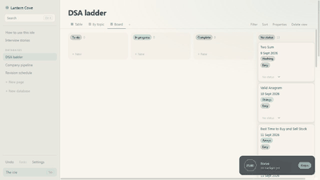
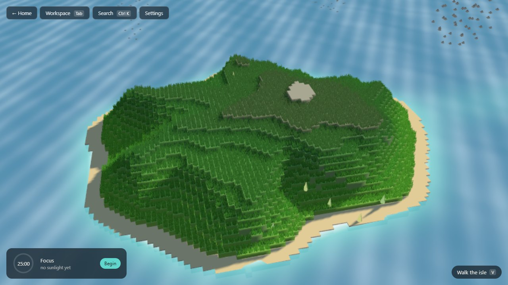
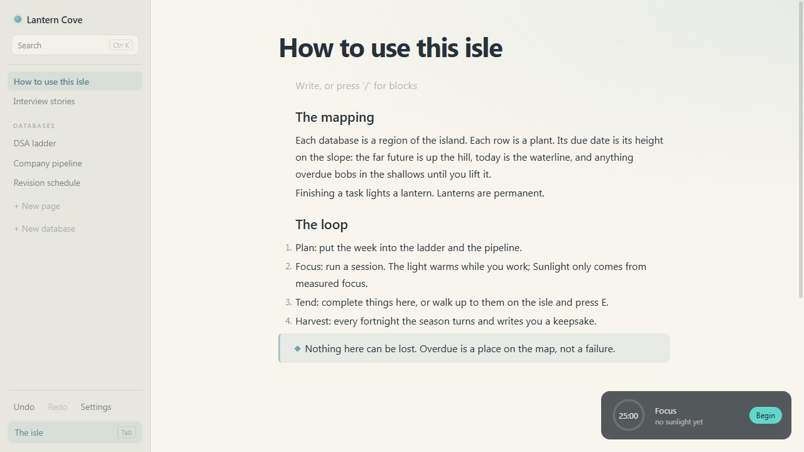
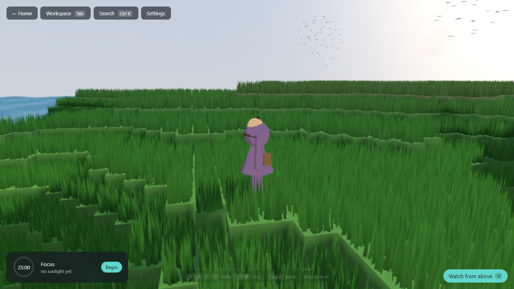
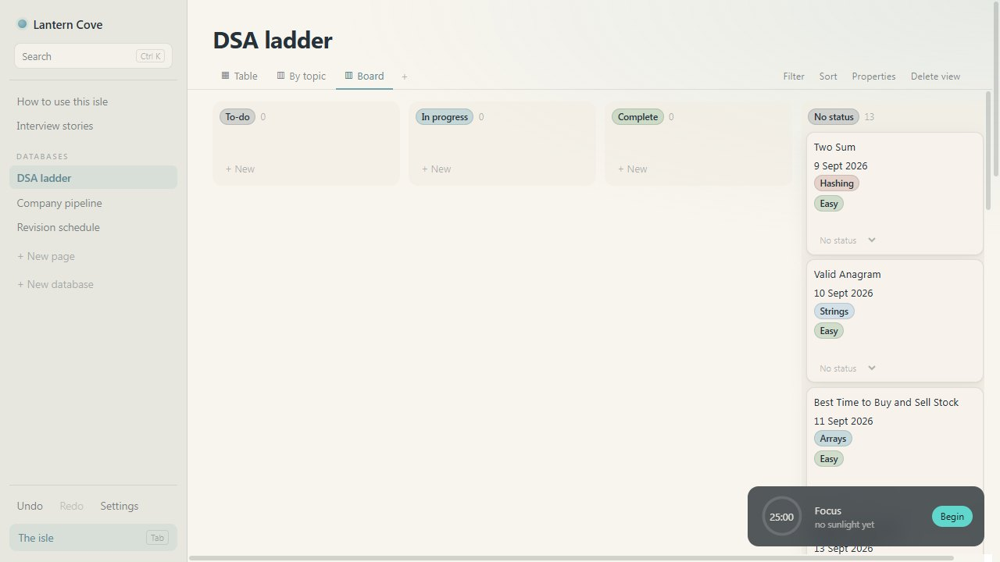

<p align="center"></p>

# Tidewick

**A local-first workspace that grows into a living island.**

One half is a Notion-class workspace: nested block editor, user-defined
databases, six view types, relations, rollups, a formula engine. The other half
is a toon-shaded island, simulated and rendered on the GPU, that *is* that
workspace drawn as terrain. Projects are regions. Tasks are plants. A due date
is an **elevation** — work due far out sits in the highlands and drifts downhill
toward the shore as its date approaches. Everything finished becomes a lantern.

All data stays on the device. No accounts, no telemetry, no network calls.

> **Status: all 8 phases built and green (658 tests, 4/4 shaders naga-valid, names grep clean, Windows binary launched, offline verified). The 60 fps budget is now measured on the brief's own hardware - Intel Iris Xe over WebGPU - and met at Medium with a 75% render scale; the erosion CPU-vs-GPU table is measured, not estimated. Every compute shader has now executed on a real GPU. Still open: the other five platform builds.**



*Recorded from a real Edge window on Intel Iris Xe over WebGPU with the DevTools
protocol driving the app: founding, the Placement Prep template, the workspace,
then the isle from dawn to dusk. The full 45-second tour is
[docs/tour.gif](docs/tour.gif).*

## Install on Windows

Tidewick ships as a desktop app through Tauri, with the same code the web build
runs. On this laptop it is built and installed from source:

```bash
pnpm install
pnpm tauri build
```

That produces, under `src-tauri/target/release/bundle/`:

- `nsis/Tidewick_0.1.0_x64-setup.exe` - a per-user installer, no admin prompt;
  it puts Tidewick in the Start menu and on the desktop.
- `msi/Tidewick_0.1.0_x64_en-US.msi` - the same app as an MSI, for machines
  that deploy that way.

The app runs in WebView2 (Edge's engine), so on a machine whose Edge has WebGPU
the desktop build takes the WebGPU path too; everything else falls back to
WebGL2 as the web build does. On this laptop the installed app boots on WebGPU
with the Intel Iris Xe adapter, runs its first-start benchmark, and settles at
Medium with a 66% render scale (48 fps, 11.7 ms of GPU per frame in the HUD).
No network, no account, no telemetry: the isle lives in the app's own storage
on this device, and no service worker runs inside the shell.

The logo is `public/logo.svg` - a terraced isle at dusk with a lantern lit on
its summit, in the isle's own palette - and every icon (Windows `.ico`, the
Start-menu tiles, the PWA set, the favicon) is generated from it with
`pnpm tauri icon public/logo.svg`.

| The isle at golden hour | The workspace, one template in |
|---|---|
|  |  |
| **Walking it as the Keeper** | **The board view of the DSA ladder** |
|  |  |

> Terrain pipeline, renderer, WebGL2 fallback, fixed-timestep loop, performance
> HUD, world clock, shore-aware sea, home page, Command stack, local
> persistence, the block editor, user-defined databases with five view types,
> the derived island, a formula engine, Timeline, bidirectional relations, a
> Gerstner ocean, a walkable Keeper, the gentle loop, grass, birds, a painted
> sky, a command palette, starter packs, import/export, sound and a PWA shell
> are built and tested (635 tests). The isle grows from real workspace data:
> projects are regions, tasks are plants, and a due date is an elevation - you
> can walk up to a plant and tend it, and the light warms while you work. See
> [PLAN.md](PLAN.md) for what is measured and what is not.

---

## The one rule

```
IslandSnapshot = derive(WorkspaceState)
```

There is no game save and no score file. Every hill, plant, path and lantern is
computed from workspace data on demand, and even the island's *shape* is a
deterministic function of a stable hash of the workspace. The island cannot
drift out of sync with reality because it holds nothing to drift.

The inverse holds too: tending a plant in the world dispatches the same Command
object the DOM interface dispatches. There is exactly one mutation path.

---

## Running it

```bash
pnpm install
pnpm dev
```

Then open http://localhost:5183. Press `F3` for the performance HUD.

```bash
pnpm check        # typecheck + WGSL validation + tests
pnpm test         # 635 unit tests
pnpm names        # the grep for hard-coded personal names (Section 16)
pnpm shaders      # validate every WGSL shader with naga
pnpm typecheck
```

Shader validation needs `cargo install naga-cli`. Without it the check is
skipped rather than failed, so a machine without Rust can still run `pnpm check`.

---

## The formula engine

Hand-written lexer and recursive-descent parser, because the error messages are
half the product. A generated parser gives a correct grammar and then says
"unexpected token at position 14"; every error here carries a span, so the
editor underlines the characters and says what it expected instead. Typing a
bare `Status` is told to write `prop("Status")`.

`prop()` accepts a string literal and nothing else. A computed column name would
make the dependency graph undecidable — and undecidable means no cycle
detection, which is the feature the graph exists for.

**Cycles are refused at edit time**, checked against the graph the edit *would*
create, so nothing invalid ever reaches the store:

```
A = prop("B") + 1
B = prop("A") + 1     ->  These formulas depend on each other in a loop: A -> B -> A.
```

The search is an iterative DFS with three-colour marking. A recursive version is
half the length and blows the stack on a long chain — which is precisely the
input someone is holding when they discover the feature. A 12,000-deep chain
closed into a loop is detected in under 500 ms.

Coercion is deliberately narrow. Arithmetic on text is an error with a message,
not a silent zero: a spreadsheet that quietly turns `""` into `0` produces
answers that are wrong in a way nobody notices for months. And `if` does not
evaluate the branch it skips, so `if(empty(prop("X")), 0, 100 / prop("X"))` is
something you can actually write.

---

## Architecture

```mermaid
flowchart LR
  subgraph DOM["Workspace (DOM)"]
    UI[React views
editor, six database views]
    CMD[Command objects
apply / invert]
    STORE[(Zustand + Immer
WorkspaceState)]
    DEX[(Dexie / IndexedDB)]
    UI -->|dispatch| CMD --> STORE
    STORE -->|write-behind 400 ms| DEX
  end
  subgraph WORKERS["Workers"]
    DW[derive worker
IslandSnapshot = derive(state)]
    TW[terrain worker
noise → erosion → terrace → mesh]
  end
  subgraph GPU["Island (GPU)"]
    BR[bridge
dirty ranges → interleaved buffer]
    PL[plants
placed in the vertex shader for any now]
    SC[grass · birds · sky · sea · Keeper]
    POST[ink outline + bloom]
  end
  STORE -->|whole state| DW -->|transferables| BR --> PL
  TW -->|heightfield, bands| SC
  PL & SC --> POST
  KEEP[Keeper intents
tend, reschedule] -->|same Command objects| CMD
```

One rule holds the diagram together: the island reads the workspace and
never writes anything but ordinary commands. There is no game save.

## The erosion benchmark

Measured in the browser's terrain worker on this machine (WebGL2 path; the
worker is spawned and warmed during renderer init). Every number is a
single-island generation at the 256-cell erosion grid.

| Droplets | Tier | Erosion, cold worker | Erosion, warm | Whole pipeline, cold |
|---|---|---|---|---|
| 65,000 | High | 283-324 ms | - | 387-453 ms |
| 48,000 | (earlier Medium) | 262-298 ms | 215-263 ms | 414-443 ms |
| 40,000 | Medium | 137-200 ms (Edge, Iris Xe machine) | - | 206-260 ms |

**CPU versus GPU, measured** (Edge, WebGPU, Intel Iris Xe, 256² grid; the GPU
runs on a standalone compute device, `__tidewick.bench(id, droplets)`):

| Droplets | CPU | GPU (+ transfer) | Speed-up | Terrace bands that differ | Land/sea cells that differ |
|---|---|---|---|---|---|
| 65,000 | 325 ms | 183 ms (+8) | 1.8× | 5.1% | 0.44% |
| 130,000 | 567 ms | 121 ms (+14) | 4.7× | 4.2% | 0.36% |
| 260,000 | 1,087 ms | 318 ms (+15) | 3.4× | 3.6% | 0.31% |

The first GPU call in a page carries roughly 190 ms of pipeline compilation
(a cold 65k run measured 370 ms). The disagreement columns are the point of
the harness: GPU droplets race on the height field, so the two paths do not
produce the same island - and that is why **the GPU path does not carve the
isle**. Its shape is a promise made on the first screen, and the seeded CPU
walk keeps it, deterministically, inside the budget. The GPU number is a
benchmark, and now a real one.

The pipeline budget is 400 ms. It is met with a warm worker and missed cold by
up to 10%; the remaining cold cost is JIT warm-up rather than droplet count,
which is why Medium now runs 40k droplets and the worker is warmed during
renderer initialisation.

## Bundle

Production build: main bundle 1356 kB, CSS 47 kB, workers 13 kB
(before gzip). Desktop: `pnpm tauri build` produces `tidewick.exe` with MSI and
NSIS installers; the binary has been launched and closed cleanly.

## Everything else in the product, briefly

- **Ctrl+K** opens one box that finds pages, rows, databases, text inside
  blocks, and the actions with no other keyboard home. It is a plain scan with
  a deliberate ranking (starts-with, then contains, then body match, recency
  breaks ties) and no fuzzy matching, because fuzzy matching surfaces
  "Seasons" for "Two Sum" after a week and nobody trusts the box again.
- **Starter packs are data** (`src/packs/`). Placement Prep, Weekly Review and
  Reading List are plain descriptions turned into the ordinary commands you
  would have dispatched by hand - which is why a pack is one undo away from
  never having happened, and why nothing in the engine knows what a "DSA
  ladder" is. Dates are relative to now so nothing arrives already overdue.
- **Export is the whole workspace**, as JSON, stamped with the schema version
  and byte-for-byte re-importable. Import refuses what it cannot read (a file
  from a newer build, a file that is not ours) rather than half-loading it. A
  page exports as Markdown, lossy on purpose.
- **Settings describe the device, not the isle** - quality tier, sound, cloud
  cover - so they live in `localStorage` rather than the workspace. They are
  the one deliberate exception to "no state outside the workspace", and the
  reason is that an exported phone tier should not apply to the desktop that
  imports it.
- **Sound is synthesised**: the sea is filtered brown noise with a slow swell,
  the wind a wandering band-pass, the lantern bell three sine partials. Off by
  default; the `AudioContext` is not created until you ask.
- **Offline on the web** is a hand-written service worker: the shell is
  network-first with a cached fallback, hashed assets are cache-first forever.
  The workspace itself never touches the network - it lives in IndexedDB.

---

## Sunlight is the only resource, and it cannot be farmed

It accrues per minute of measured, uninterrupted focus and from nothing else.
There is no path from creating a task, editing one, browsing, or wandering the
island — `accrue()` takes focus seconds and a multiplier, and that is the whole
signature. If a second source existed someone would find it, and the island
would stop being an honest record of the work. That honesty is the product.

The session is deliberately hard to fool. It ends on *focused* time rather than
wall-clock, so twenty-five minutes of which ten were spent in another window is
not a finished session. Time is read from the wall clock each tick rather than
summed from frame deltas, because a background tab throttles `requestAnimationFrame`
and accumulating deltas would quietly under-count the exact case the blur rule
exists to catch.

**The six cozy guarantees** (Section 3.6 of the brief) are invariants of
`loop/economy.ts`, and `guarantees.test.ts` is written adversarially against
them — it hunts for the fail state, tries to farm the currency by clicking,
tries to make deleting a task cost something, and passes only when it cannot. A
comment saying "no fail state" is worth nothing the day someone adds a
plausible-looking penalty branch.

Two consequences worth stating plainly:

- **Running out of Sunlight cannot block a completion.** The task still
  completes; the bloom is simply plainer. Gating real work behind a resource
  would be a fail state wearing a friendly hat.
- **Three weeks away leaves a quiet island, never a dead one.** Decay eases to
  a floor at 55% warmth and stops there, and one visit restores it completely.

---

## The island is an input surface, not a picture of one

Walking up to a plant and pressing `E` completes the task. Carrying an overdue
plant out of the shallows and setting it down higher up the hill reschedules it.
Neither of these is an island feature.

`keeper/system.ts` never imports the store. It emits an intent — `onTend`,
`onReschedule` — and `keeper/commands.ts` turns that into the *same*
`SetPropertyValue` the table view dispatches when you edit the cell by hand.
There is no island-only mutation path, which is why undo, persistence and the
derived isle cannot disagree about what happened.

The reschedule is the elevation mechanic run backwards:

```ts
elevationFor(dueMillis, now)          // a date  -> a height on the slope
dueDateForPosition(x, z, profile, now) // a height -> a date
```

Section 3.3 asks that rescheduling feel like rescue rather than failure. That is
the whole mechanism: you carry the plant up the hill, and putting it down *is*
the new date.

**On the character, plainly:** there is no rigged model and no animation clips
in this project. The six-state machine and its crossfades are real; the poses
are computed from a stride phase rather than sampled from a curve. Swapping in a
rigged GLB replaces `render/keeper.ts` and `poseFor()` and nothing else.

---

## The island is a pure function of the workspace

`derive(WorkspaceState) -> IslandSnapshot` reads nothing but its argument: no
clock, no randomness, no hidden state. Databases become regions of the isle,
rows become plants, and a status group becomes a growth stage. There is no game
save to desync, because there is no game save.

**A plant's position is not part of the snapshot, on purpose.** Elevation is a
function of how long remains before a task is due, and that changes every
second; storing a position would mean re-deriving the world constantly just to
animate the drift. Instead every instance carries its due date, and the vertex
shader places it against the terrain for whatever `now` currently is:

```
level  = clamp((due - now) / horizon, -0.18, 1)   // 1 = misty peak, 0 = waterline
radius, height = profile(angle, level)             // one texture fetch
```

So downhill drift costs a single uniform write per frame, `derive()` stays
clock-free and therefore exhaustively testable, and the island cannot fall out
of step with the workspace because it never held a position to fall out of step
with. The `profile` lookup is the terrain reduced once to a 64x48 table of
*at this angle, at this elevation, here is the ground* - built in
`render/terrain/profile.ts`.

The bridge diffs each new snapshot against the last and uploads only the
changed instance ranges. Ticking one to-do in a workspace of eight tasks sends
**28 bytes** - one instance, seven floats - not the whole buffer.

---

## A row is a page

Databases are user-defined: sixteen property types, arbitrary schemas, and no
domain hard-coded into the engine - the Placement Prep pack is data built from
these primitives, not a set of built-in tables.

The load-bearing decision is that **a database row is a Page**. Section 4 maps
"Page / Task" to a plant on the island and "Database / Project" to a region; if
rows were a separate entity type, every derivation would need two code paths for
the same idea. Instead a row has a title, a body of blocks and a bag of property
values, and the island does not care which of those a plant grew from.

The query engine that filters, sorts and groups is pure and free of React, for
the same reason: from Phase 4 the derivation worker calls it too. A Board column
and a region of the isle are the same query over the same rows, and if they were
not, the two halves of the product would disagree about reality.

---

## Why the editor is hand-written

TipTap would have shipped faster, and it is the wrong choice here. ProseMirror
owns its own transaction system and its own undo history, and this project's
load-bearing rule is that there is exactly **one** mutation path and exactly one
history - shared by the DOM interface and, from Phase 6, by the Keeper out on
the island. Adopting a second one means reconciling two, which is the specific
failure the architecture exists to prevent.

There is a derivation cost too. Blocks in a ProseMirror document are opaque to
`derive()`, so mapping a checklist item to a bud on a plant means walking
serialised JSON, and the dirty set degrades from per-block to per-page - typing
one character would re-derive an entire page of the island.

So blocks are entities in the normalised store, every edit is an invertible
Command, and `editor/inline.ts` pays the price: marks as half-open character
ranges, DOM serialisation both ways, and caret-to-offset mapping by hand. Ranges
rather than a node tree, because overlapping bold and italic is ordinary and a
tree forces one to be the parent of the other - which turns "extend the bold by
a word" into a restructuring problem instead of moving a number.

---

## The home page

The island behind it is the real, running scene, lit by the actual time of day.
Entering the isle is a camera move and a scrim fade, never a scene load — the
same principle Section 11 asks for between the workspace and the world, applied
one level up.

Founding an isle does **not** let you type your way to a different island. The
terrain seed hashes the workspace id, not the name, so renaming your isle later
cannot bulldoze it — which means the shape has to be settled once, at founding,
and never again. *Show me another* rolls a new id and regrows the land; once you
begin, that island is permanently yours.

---

## Erode, then terrace

The brief specified droplet hydraulic erosion. The art direction is chunky
flat-shaded low-poly with hard cliff faces. These look incompatible and are not:

1. Generate a base heightfield from the workspace seed. Two ridged-noise layers
   decide where the highlands are and break them into ridges; a domain warp and
   a sea-pressure term decide where the coastline falls.
2. **Erode it.** Thousands of droplets pick up, transport and deposit sediment,
   carving drainage channels that no amount of stacked noise produces — because
   real valleys are the *history* of water, not a frequency band.
3. **Then quantise** height into discrete bands and mesh it as flat-shaded
   plateaus with vertical cliff walls between them.

The cliff walls end up following the eroded valley network. Neither step
produces that on its own.

Two proportions turned out to matter more than any amount of colour tuning:

- **Riser must be shorter than tread.** A band is `peakHeight / (bands - 1)`
  tall. When that exceeds the plateau width the island becomes a staircase
  steeper than 45°, every step drops its neighbour into full shadow, and the
  terraces read as dark corrugation. `peakHeight` is set from this constraint,
  not from taste.
- **Ink almost nothing on the interior.** Every terrace lip is a 90° normal
  discontinuity, and at diorama zoom a cliff face is 2–3 pixels tall — so a
  normal-based edge detector fills each riser *solid* with outline colour. The
  terrain stops responding to light entirely, which is a genuinely confusing
  failure to diagnose, because adjusting lamps and palettes does nothing at all.
  The outline pass is therefore depth-dominant: silhouettes against sky and sea
  ink, interior creases do not. The reference art separates terraces by colour —
  grass on top, stone on the wall — for the same reason.

---

## Erosion benchmark

Grid 256×256, 65,000 droplets, 36-step lifetime, brush radius 2.

| Path | Erosion | Base gen | Terrace | Mesh | **Total** |
|---|---|---|---|---|---|
| **CPU** (worker, WebGL2 fallback) | 329 ms | 115 ms | 9 ms | 22 ms | **476 ms** |
| **CPU** (Node 24, same machine) | 336 ms | 53 ms | — | — | — |
| **WGSL compute** (Iris Xe, WebGPU, standalone device) | 183 ms warm, 370 ms incl. compile | — | — | — | — |

Measured in-browser on Intel integrated graphics: the CPU rows via ANGLE/D3D11
on the WebGL2 path, the compute row in Edge on WebGPU. The GPU wins from 65k
droplets up (1.8× there, 4.7× at 130k) and is not used for the isle: see the
determinism note under "The erosion benchmark" above.

**The 400 ms budget is currently missed by 76 ms on the CPU path.** Two honest
notes on that:

- It is off the main thread, so nothing blocks; the cost is a slower first
  paint, not a stutter.
- The GPU path is expected to close it comfortably — erosion is the dominant
  term and it is the part that moves to the GPU — but **that is a prediction,
  not a measurement**, and it is labelled as such until it runs.

### Why the GPU number is missing

No machine available to this project has a WebGPU adapter. `navigator.gpu`
exists in the dev browser, but `requestAdapter()` returns `null`, so both the
renderer and the compute path fall back. The WGSL is validated offline with
`naga` (the same front-end `wgpu` uses), so it is well-formed and the bindings
type-check — but validation is not execution, and the shader has never run.

Run `window.__tidewick.bench()` in the dev console on a WebGPU-capable browser
to fill the row in. It reports timings *and* CPU-vs-GPU divergence, because:

### Parallel droplet erosion is racy, and that is worth measuring

WGSL has no float atomics, so the heightmap is fixed-point `i32` accumulated
with `atomicAdd`. Additions commute, so the totals are correct — but a droplet
can read a cell midway through another droplet's update, and scheduling order
varies per device. CPU and GPU therefore do **not** produce byte-identical
heightfields.

Claiming otherwise would be easy and wrong. Instead the benchmark reports how
much divergence survives downsampling, smoothing and quantisation into 12 bands
— which is the only figure a player can perceive.

Droplet spawn positions are generated on the CPU and uploaded, so both paths
start from byte-identical droplets and the difference is attributable to the
races alone. Droplet count and grid are also identical across paths, so the same
workspace grows the same island on every device; what the GPU buys is headroom
to re-erode when a project is added, not a different terrain.

---

## The WebGL2 fallback is not optional

WebGPU support in system WebViews varies by platform and version, and this ships
as a desktop and mobile binary. The consequence that shapes the whole renderer:
**WebGL2 has no compute shaders.** Three's TSL falls back for *materials*, but
`renderer.compute()` requires the WebGPU backend.

So every compute workload gets a declared fallback strategy rather than a second
shader nobody maintains:

| Workload | WebGPU | WebGL2 fallback |
|---|---|---|
| Hydraulic erosion | WGSL droplets on a standalone device | CPU in a worker — already the reference implementation, and the benchmark control |
| Spectral ocean | Stockham IFFT compute — **executed on Iris Xe**: a 256² transform (spectrum + 16 butterflies + resolve) in **5.7 ms**, 512² in 19 ms; matches a plain-JS inverse DFT to 5e-9 (`__tidewick.fft()`) | Gerstner sum-of-sines, shore-damped — **this is what ships**, on both backends |
| Vegetation | — | One instanced draw: a triangle per blade, wind in the vertex shader, 250k blades at Medium and 1M at High. No compute cull was needed; the whole field is one draw call and the vertex shader is the cost, so the tier count is the lever |
| Flocking | `boids.wgsl.ts`: hashed grid, four dispatches (count, prefix sum, scatter, steer) — **executed on Iris Xe**: 50,000 agents in **0.78 ms per step**, 100,000 in 0.54 ms, finite, in the speed band, holding five flocks (`__tidewick.boids()`) | CPU flock with a counting-sort spatial hash, 120–1,600 agents by tier in five flocks — **this is what ships**, by art direction: a few hundred birds in groups read as birds, fifty thousand read as smoke |

Erosion runs on its **own `GPUDevice`**, not the renderer's backend, because a
one-shot compute job needs no canvas. That means it still runs on machines that
expose WebGPU for compute but cannot create a WebGPU canvas context — a real
configuration that a backend-coupled design would have thrown away.

The HUD always shows which path is live.

---

## Performance budgets

Two machines appear below. **Iris Xe** rows are the brief's target hardware:
this laptop's Intel gen-12lp integrated GPU, reached through a real Edge window
on the WebGPU backend at a 1920×1080 drawing buffer. **RTX 3050** rows are the
same laptop's discrete GPU through the development browser pane, WebGL2 backend,
also at 1920×1080.

| Metric | Target | Measured |
|---|---|---|
| Draw calls | < 200 | **38** per frame at Medium and at High: the whole grass field is one draw, the flock is one draw |
| Frame rate | 60 fps @ 1080p, Medium, Iris Xe | **Met at 75% render scale: 16.8 ms per presented frame (GPU 13.6 ms)** on Iris Xe over WebGPU, with Medium tuned to depth-only ink, a 1024 shadow map and no bloom. At 100% scale the same tier presents at 33 ms (GPU 19 ms); the untuned Medium was 50 ms (GPU 38 ms) and the detected "High" 92 ms. Running unattended, the first-run benchmark stepped 100% → 85% → 75% → 66% and settled at 66%: 16.7 ms, GPU 10.4 ms - one step lower than the isolated run, because 75% sat within a millisecond of the tolerance and a 120 Hz panel rounds a near miss up to 25 ms. WebGL2 backend on the same GPU: 58 ms untuned, 25 ms tuned |
| CPU frame time | < 4 ms | Iris Xe/WebGPU: **2-3 ms** at the tuned Medium (6 ms untuned). RTX 3050/WebGL2: **1.8 ms median** Medium, 2.5 ms High, via `benchmarkSubmit(120)` |
| GPU frame time | — | Iris Xe: **13.6 ms** tuned Medium, 38 ms untuned, from WebGPU timestamp queries resolved every frame. RTX 3050/WebGL2 gives no timestamps; serialised CPU+GPU matched submit within 0.1 ms there, so ≤ ~2.5 ms |
| Grass instances | ≥ 1M High / 250k Medium | **1,000,000 / 250,000** blades placed; 1.10M / 0.35M triangles per frame |
| Flocking agents | ≥ 50k High / 10k Medium | **50,000 agents stepped in 0.78 ms per step** on Iris Xe by the compute path (four dispatches over a 14k-cell hash grid; 10k in 0.47 ms, 100k in 0.54 ms; measured as throughput over 60 steps). The drawn flock is 900 / 260 on the CPU, an art decision, not a budget one |
| Terrain regeneration | < 400 ms, off-thread | **306–378 ms warm, 414–443 ms cold** at 48k droplets. Medium runs 40k on a worker warmed during renderer init |
| Cold start to interactive | < 2.5 s | Iris Xe/WebGPU: **1.39 s** shell, **1.96 s** isle at Medium; High 1.65 / 2.40 s. RTX 3050/WebGL2: 0.46 / 1.21 s Medium. Dev server, idle machine |
| Offline | runs offline | **Verified on the web**: production service worker activated with 5 precached entries; the app reloaded fully with the network emulated offline. Windows binary runs; other platforms unbuilt |
| GPU memory | — | **138 MB** at Medium: 47 MB of attributes (27 MB is grass), 91 MB of textures and render targets |
| Desktop binary | builds | **yes** - Windows exe, MSI and NSIS; launched, showed its WebView2 tree, closed cleanly |
| Workspace → island update | < 16 ms | **4.8–7.2 ms**, uploading 28 bytes |
| Query over 500 rows | inside one frame | **0.2 ms**; Table mounts 34 of 506 rows |

How Medium got there is in `PLAN.md` (Phase 8 checkpoint): an ablation by
reload on the Iris Xe showed the ink's normal render target cost 9 ms of GPU,
bloom 8 ms of frame and grass about 5 ms per 100k blades, so Medium dropped the
first two and kept every blade. Render scale is a device setting shown in the HUD
as the true internal size, never silently. The GPU erosion row is a benchmark,
not the product path: parallel droplets race, two runs from one seed differ by
about 5% of terrace cells, and the isle's shape is a promise - the seeded CPU
walk carves it, inside budget.

---

## Architecture

```
INTERFACE — React + TypeScript
    │ dispatches Command objects (undoable)
DATA — normalised entity store · Zustand + Immer · command stack
    │ subscribes                    │ persists
DERIVATION (Web Worker)        PERSISTENCE
derive(state) → Snapshot       IndexedDB via Dexie
pure · memoised · dirty-set    write-behind, debounced
    │ typed arrays (transferable)
GPU BRIDGE — dirty ranges only
    │
RENDERER — Three.js WebGPU · WGSL · WebGL2 fallback
GPU picking → entity id → dispatch Command (same path)
```

Phase 1 has built the bottom layer. The Command stack, store and derivation land
in Phases 2–4.

---

## Stack

TypeScript (strict) · React 19 · Vite · Three.js `WebGPURenderer` + TSL + raw
WGSL · Zustand + Immer · Dexie · Tauri v2 · Vitest · naga for offline shader
validation.
